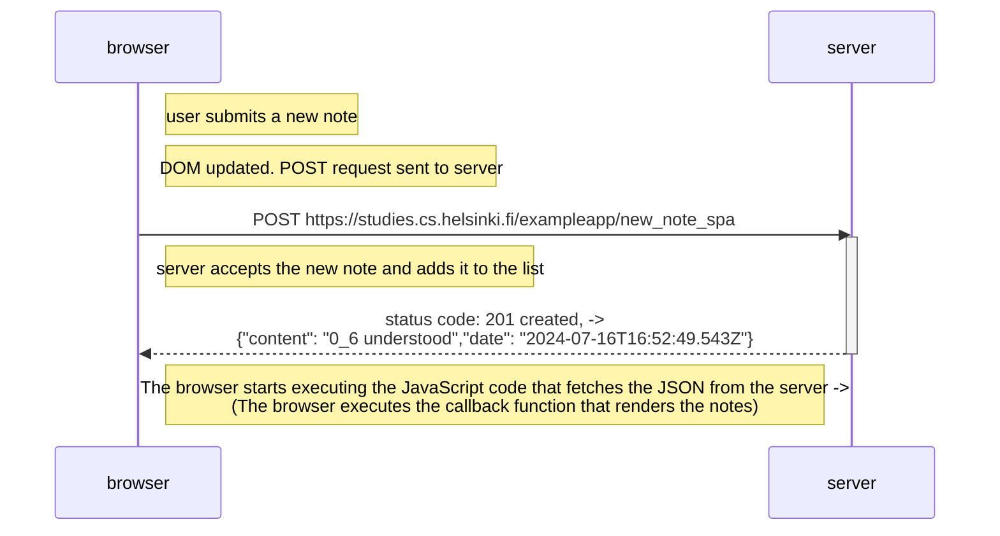

```mermaid
sequenceDiagram
    participant browser
    participant server

    Note right of browser: user submits a new note
    Note right of browser: DOM updated. POST request sent to server

    browser->>server: POST https://studies.cs.helsinki.fi/exampleapp/new_note_spa
    activate server
    Note right of browser: server accepts the new note and adds it to the list 
    server-->>browser: status code: 201 created, -><br> {"content": "0_6 understood","date": "2024-07-16T16:52:49.543Z"}
    deactivate server

    Note right of browser: The browser starts executing the JavaScript code that fetches the JSON from the server -><br> (The browser executes the callback function that renders the notes)
```
